# React
hello, friends this is subhankar nath.today we are learn the react.so , react is a javascript library for building user interfaces.it is developed by facebook.

## Table of Contents

- [Installation](#installation)
- [Folder structure](#folder-structure)
- [Project Flow](#project-flow)
- [Run Project](#run-project)
- [Useful Tools and Extensions](#useful-tools-and-extensions)
- [Components](#components)
- [Add Css Styles](#add-css-style-inside-components)
- [Inspect Page using React Developer Tools](#inspect-page)
- [JSX](#jsx)
- [Conditional Rendering](#conditional-rendering)
- [Array and Object](#array-and-object)
- [Props](#props)
- [Function and Events](#function-and-events)
- [State](#state)
    - [Props vs State](#props-vs-state)
    - [Types of State](#types-of-state)
    - [useState()](#what-is-usestate)
    - [Form Handling](#form-handling)
    - [Todo App](#todo-app)
    - [useRef()](#useref)
    - [useEffect()](#useeffect)
    - [Timer](#timer)
    - [Important Notes](#important-notes)
    - [What is React Strict Mode?](#what-is-react-strict-mode)
    - [React LifeCycle](#react-lifecycle)
    - [Cleanup Function](#cleanup-function)
    - [React Router](#react-router)


## Installation
create the react project with the given command `npm create vite@latest`.
here vite is a powerful build tool, it supports hot reload.
```
E:\learning\front-end\react>npm create vite@latest

> npx
> create-vite

|
o  Project name:
|  react-first
|
o  Select a framework:
|  React
|
o  Select a variant:
|  JavaScript
|
o  Use rolldown-vite (Experimental)?:
|  No
|
o  Install with npm and start now?
|  Yes
|
o  Scaffolding project in E:\learning\front-end\react\react-first...
|
o  Installing dependencies with npm...
```

## Folder structure
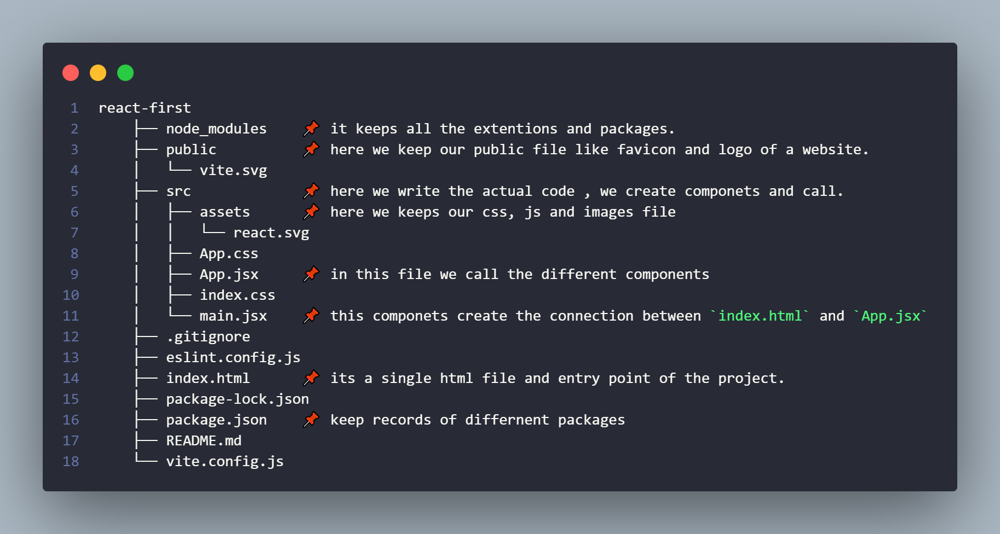

This project is created using React + Vite, which is fast and modern.

📦 **node_modules/**

- Contains all installed packages and libraries
- Created automatically when you run:
- `npm install`
- ❌ You should never edit this folder
- ❌ Not uploaded to GitHub

🌍 **public/**

- Stores public files that don’t go through React
- Files here are directly accessible in the browser
```
Example:
   favicon.ico
   logos
```
- static images
- Use this for files that never change

🧠 **src/** (Most Important Folder)

- This is where actual React code lives 🧩

🎨 **src/assets/**
- Stores images, icons, SVGs
```
Example:
react.svg
```
- Used inside components like:
- import logo from './assets/react.svg'

🎨 **src/App.css**

- CSS for the App.jsx component
- You can write component-specific styles here

🧩 **src/App.jsx**

- Main React component
- All other components are usually called from here

Example:
```javascript
function App() {
  return <h1>Hello React</h1>;
}
export default App;
```
- ➡️ Think of App.jsx as the root UI layout

🎨 **src/index.css**

- Global CSS
- Styles applied to the whole website
```
Good for:
body,
fonts,
background,
Tailwind imports
```

🚀 **src/main.jsx**

- Entry point of React
- Connects React with index.html

Example:

```javascript
ReactDOM.createRoot(document.getElementById('root')).render(
  <App />
);
```

➡️ This file:
- Starts React
- Loads App.jsx

🧾 **index.html**

- Single HTML file (SPA concept)

- React injects everything inside this file

Contains:
```html
<div id="root"></div>
```


➡️ React app runs inside this div

⚙️ **package.json**
Project configuration file
Contains:
- project name
- scripts
- dependencies

Example:

```javascript
"scripts": {
  "dev": "vite",
  "build": "vite build"
}
```

🔒 **package-lock.json**

- Locks exact versions of installed packages
- Ensures same dependencies on every machine
- Auto-generated (don’t edit)

🧹 **.gitignore**

Tells Git which files to ignore
Example:
- node_modules
- .env

📏 **eslint.config.js**

- ESLint configuration
- Helps maintain clean & error-free code

📝 **README.md**
Project documentation file

Explains:
- project purpose
- setup steps
- usage
➡️ This explanation can go here 😉

⚡ **vite.config.js**
Vite configuration file
Used for:
- plugins
- aliases
- build settings


## Project Flow
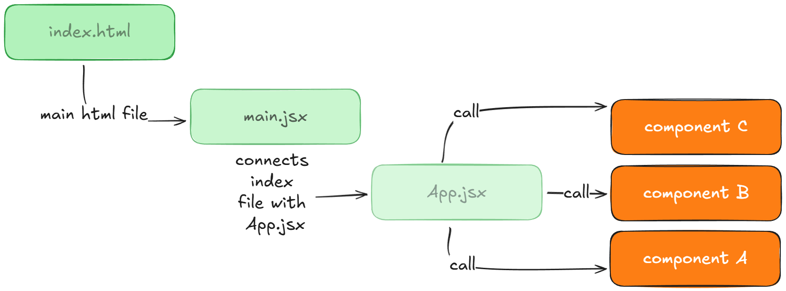

## Run Project
```
npm run dev
```
while we can change the `dev` keyword inside scripts object from `package.json` file.

like, if we want to run the project with `npm start` command, then we can change the `dev` keyword to `start`.

```javascript
"scripts": {
  "start": "vite", // 👈
  "build": "vite build"
}
```

## Useful Tools and Extensions

### Tools
download the react developement tool from the react official website [👉click here](https://react.dev/learn/react-developer-tools).

### Extensions
- ES7+ React/Redux/React-Native
- Prettier - Code formatter
- Path Intellisense
- ESLint

## Components

In React, a `component` is an `independent, reusable building block` of the user interface (UI). Components are like `JavaScript functions` that accept optional inputs called `"props"` (properties) and `return React elements` describing what should appear on the `screen`, typically using JSX markup.

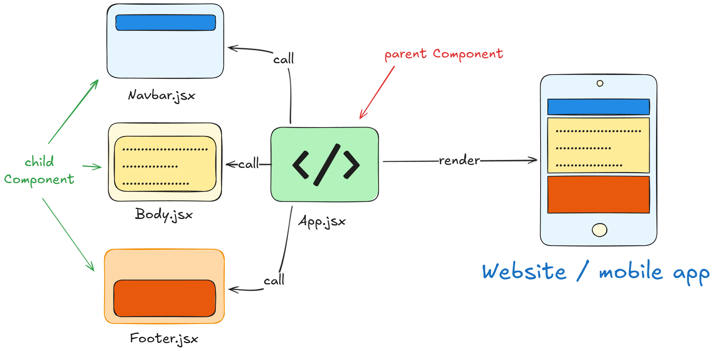

here we craete three componenet files inside components folder.
- Header.jsx
- Body.jsx
- Footer.jsx

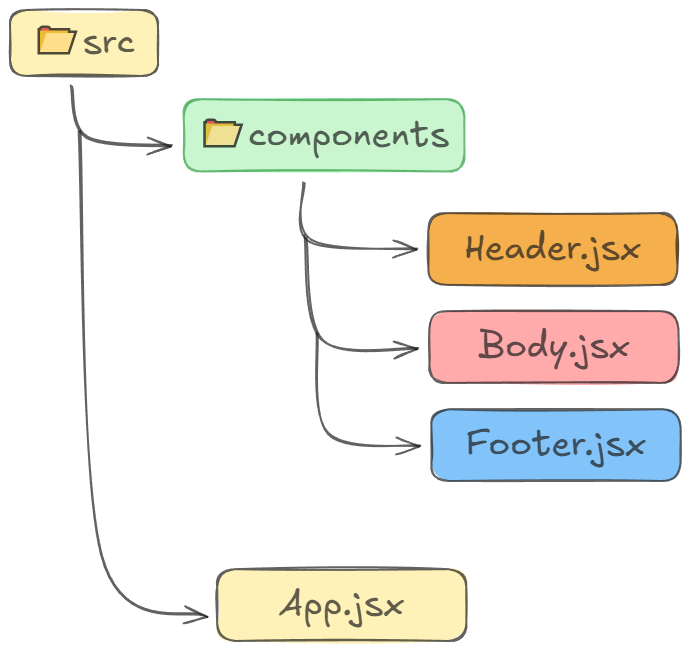

⭐⭐⭐ here we use `jsx` syntax. which is a `extension of javascript`.means we can `write html inside javascript`. but it is not mandatory to use jsx. we can also use plain javascript.

### Step:1
create folder and create three files.

### Step:2
create and export the components form the file , like below.
here i put the below code inside `Body.jsx` file.
- ⭐ file name must be starting with capital letter like `Header/Body/Footer`
- ⭐ extentions must be `.jsx`
- ⭐ export the functions.
- ⭐⭐ here i type `rafce` which gives me a react export function. 
`rafce: react arrow function components export`

```javascript
const Body = () => {
  return (
    <div>
        <h2>🔥 Content Area</h2>
        <p>........</p>
    </div>
  )
}

export default Body
```

like that you have to create rest two componets and export them.

- 1️⃣ Header.jsx
```javascript
const Header = () => {
  return (
    <div>
        <h1>Header</h1>
        <ul>
            <li>Home</li>
            <li>About</li>
            <li>Contact</li>
        </ul>
    </div>
  )
}

export default Header
```

- 2️⃣ Body.jsx
```javascript
const Body = () => {
  return (
    <div>
        <h2>🔥 Content Area</h2>
        <p>Lorem ipsum dolor sit amet consectetur adipisicing elit. Quas reiciendis temporibus eius porro! Temporibus alias fuga, necessitatibus maxime omnis totam iusto adipisci dolorum, quae ipsam nostrum suscipit mollitia. Rem vitae delectus asperiores nam, rerum magnam quis officia iure, nemo adipisci optio laudantium, dolorum quidem quasi animi amet dicta non laboriosam.</p>
    </div>
  )
}

export default Body

```

- 3️⃣ Footer.jsx
```javascript
const Footer = () => {
  return (
    <div>
        <p>© 2026 React. All rights reserved. | Made with ❤️ by <a href="https://github.com/SUVO101">Subhankar Nath</a></p>
    </div>
  )
}

export default Footer
```

### Step:3
call all the components inside `App.jsx` file.
⭐ don't forget to import the component file at the top.

```javascript
import Body from "./components/Body" // 👈👈
import Footer from "./components/Footer" // 👈👈
import Header from "./components/Header" // 👈👈

const App = () => {
  return (
   <div>
      <Header/> // 👈👈
      <Body/> // 👈👈
      <Footer/> // 👈👈
   </div>
  )
}

export default App
```
🔥we can call the components by using self closing tag. 
- Synatx: `<ComponetName />`

## Add Css Style inside Components
we just use `style` attribute inside html element. like this 👉 `style={{display: "flex", gap: "15px", listStyle: "none"}}`

Example-
 ```html
<div style={{backgroundColor: "#e0fabeff", padding: "10px",border: "1px solid #ccc",textAlign: "center"}}>
        <p>--------------------</p>
</div>
 ```

 to write css style inside `jsx` we have to use `{{ }}` and also write all the css property using `👉CamelCase` like `backgroundColor` instead of `background-color`

 ```css
 backgroundColor✅
 background-color❌
 ```

 ```css
style={{backgroundColor: "#e0fabeff"}}✅
style={background-color: "#e0fabeff"}❌
```

## Inspect Page

here we already install `React Developer Tools` from the `chrome web store`. now we can inspect the page using this tool. 
we see the below image.
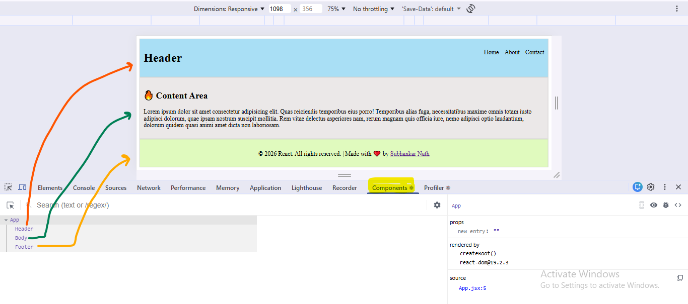
 
here we see the `App` component and its child components `Header`, `Body`, `Footer`.
so,
- **Parent Component**: `App`
- **Child Components**: `Header`, `Body`, `Footer`

## Jsx


### 🔹 What is JSX?
- JSX stands for JavaScript XML.
- JSX allows us to write HTML-like code inside JavaScript.

- It makes React code:
- - ✅ Easy to read
- - ✅ Easy to write
- - ✅ Easy to understand

### 🔹 Why JSX is Used?

- Without JSX, writing UI in React is hard and confusing.

❌ Without JSX (Pure JavaScript)
```javascript
React.createElement(
  "h1",
  null,
  "Hello React"
);
```
✅ With JSX (Easy & Clean)

```html
<h1>Hello React</h1>
```
👉 JSX is NOT HTML, but it looks like HTML.

### 🔹 Important Point (Interview 🔥)

JSX is converted into JavaScript by Babel before running in the browser.

- Browser ❌ does not understand JSX
- Browser ✅ understands JavaScript
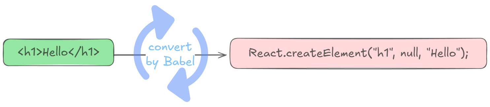

### 🔹 First JSX Example
```javascript
function App() {
  return <h1>Hello World</h1>;
}

export default App;
```
📌 This is a React component written using JSX.

### 🔹 JSX Rules

- 1️⃣ JSX Must Return One Parent Element

❌ Wrong

```javascript
return (
  <h1>Hello</h1>
  <p>Welcome</p>
);
```


✅ Correct (Using div)

```javascript
return (
  <div>
    <h1>Hello</h1>
    <p>Welcome</p>
  </div>
);
```


✅ Better (Using Fragment)

```javascript
return (
  <>
    <h1>Hello</h1>
    <p>Welcome</p>
  </>
);
```

- 2️⃣ Use className Instead of class

❌ HTML

```html
<div class="box"></div>
```


✅ JSX

```html
<div className="box"></div> // 👈
```


📌 Because class is a JavaScript keyword.

- 3️⃣ JavaScript Inside JSX {}

You can write JavaScript expressions using {}.

```javascript
function App() {
  const name = "React";

  return <h1>Hello {name}</h1>; // 👈
}
```

🟢 Output:

Hello React

- 4️⃣ Mathematical Expressions in JSX

```javascript
function App() {
  return <h1>Result: {10 + 5}</h1>; // 👈
}
```
🟢 Output:

Result: 15

- 5️⃣ Function Call Inside JSX
```javascript
function App() {
  const greet = () => "Good Morning";

  return <h1>{greet()}</h1>; // 👈
}
```

### 🔹 JSX Attributes
```css
 // 👈
```
📌 Attributes are written in `camelCase`.

### 🔹 Inline Styling in JSX

❌ Wrong

```css
<h1 style="color:red">Hello</h1>
```
✅ Correct
```javascript
<h1 style={{ color: "red", fontSize: "20px" }}>
  Hello
</h1>
```
📌 Styles are written as JavaScript objects.

### 🔹 Conditional Rendering in JSX
Using Ternary Operator
```javascript
function App() {
  const isLoggedIn = true;

  return (
    <h1>{isLoggedIn ? "Welcome User" : "Please Login"}</h1>
  );
}
```

### 🔹 Rendering List Using JSX (map)
```javascript
function App() {
  const fruits = ["Apple", "Banana", "Mango"];

  return (
    <ul>
      {fruits.map((fruit, index) => (
        <li key={index}>{fruit}</li>
      ))}
    </ul>
  );
}
```
📌 key helps React identify elements efficiently.

### 🔹 JSX Comments

```
{/* This is a JSX comment */}
<h1>Hello JSX</h1>
```

### 🔹 Boolean Attributes in JSX
```javascript
<button disabled>Click Me</button>
```
OR
```javascript
<button disabled={true}>Click Me</button>
```

## Conditional Rendering

here we create a file named `ConditionalRendering.jsx` inside `components` Folder.

now we simply export it and call it inside `App.jsx` file. like below.
```
<ConditionalRendering/>
```

- ### 1️⃣🟡🟢🔴

and inside `ConditionalRendering.jsx` write the below code 

```javascript
const ConditionalRendering = () => {
  const isLoggedIn = false;
    return (
      <div>
          { isLoggedIn ? <h1>Welcome User</h1> : <h1>Please Login</h1> }
      </div>
    )
};
export default ConditionalRendering;
```
⭐ here we create a variable and based on the value we can show different value. here we simply check the value of `isLoggedIn`. if the `isLoggedIn` value is `true` then show `Welcome User` else `Please Login`. here we use `ternary operator`.

**🔴 Syntax: `condition ? true : false;`**

- ### 2️🟡🟢🔴

using `and` operator. modify the code inside `ConditionalRendering.jsx` and write the below code 

```javascript
const ConditionalRendering = () => {
  const isLoggedIn = true;

  return (
    <div>
        { isLoggedIn && <h1>Welcome User</h1> }
    </div>
  );
};
export default ConditionalRendering;
```
⭐ Here we check the isLoggedIn value.
If isLoggedIn is `true`, then the `<h1>Welcome User</h1>` will be rendered on the screen.
If isLoggedIn is `false`, `nothing` will be rendered.
- `true && JSX` → JSX is shown ✅
- `false && JSX` → nothing is shown ❌


- ### 3️⃣🟡🟢🔴

modify the `ConditionalRendering.jsx` code 
```javascript
const ConditionalRendering = () => {
  const isLoggedIn = false;
  let message;

  if (isLoggedIn) {
    message = <h1>Welcome User</h1>;
  } else {
    message = <h1>Please Login</h1>;
  }

  return <div>{message}</div>;
};
export default ConditionalRendering;
```
⭐ here we create a variable and based on the value we can show different value. here we simply check the value of `isLoggedIn`. if the `isLoggedIn` value is `true` then  `Welcome User` else `Please Login` and also store the value inside `message` variable. then print it.

- ### 4️⃣🟡🟢🔴

Conditional Rendering with css file

- - `Step:1:` create a css file named `ConditionalRendering.module.css` inside `css` Folder.
- - `Step:2:` write the below code
```css
.login{
    background-color: red;
    padding: 10px;
}

.welcome{
    background-color: green;
    padding: 10px;
}
```
- - `Step:3:` now import the css file inside `ConditionalRendering.jsx` file.
```javascript
import style from "../css/ConditionalRendering.module.css";
```
- - `Step:4:` now use the css file inside `ConditionalRendering.jsx` file.
```javascript
<h1 className={isLoggedIn ? style.welcome : style.login}>{isLoggedIn?'Welcome User':'Please Login'}</h1>
```
- - `Step:5:` Full Code
```javascript
import style from "../css/ConditionalRendering.module.css";

const ConditionalRendering = () => {
  const isLoggedIn = true;

  return (
    <div>
        { <h1 className={isLoggedIn ? style.welcome : style.login}>{isLoggedIn?'Welcome User':'Please Login'}</h1>}
    </div>
  );
};

export default ConditionalRendering;
```

## Array and Object 

we can print the array using `map` function and print the object using `dot(.)`.

### Map Syntax
```javascript
array.map((value,index)=>(
    <li key={index}>{value}</li>
))
```

### Object Syntax
```javascript
object.key
```

we can create a component  and pass array and object as a props.

Component File - `Array_Object.jsx` and paste the below code.

```javascript
const Array_Object = ({skills,user}) => {
  return (
    <div>
        <h1>Array Print</h1>
        <ul>
            {
                skills.map((value,index)=>(
                    <li key={index}>{value}</li>
                ))
            }
        </ul>
        <h1>Object Print</h1>
        <p>{user.name} , {user.age} years old.</p>
    </div>
  )
}

export default Array_Object
```

call the Component File inside `App.jsx` file and paste the below code.
```javascript
import Array_Object from "./components/Array_Object"

<Array_Object skills={['html','css','javascript']} user={{name:'subhankar',age:22}} />
```
> 🟡 here we use `Props` to pass data - [Click here to know more about Props](#props)


## Props

in react props are properties,using props we can pass data from one component to another component.
here we create three file named.

1. [SimpleProps.jsx](#simplepropsjsx)
2. [AdvanceProps.jsx](#advancepropsjsx)
3. [StudentInfoProps.jsx](#studentinfopropsjsx)

>⭐ Props are basically `Object`.
> ⭐⭐ Props are `Immutable` means we can't change the props value.

> ---
> ---


### SimpleProps.jsx

- `Step:1: Create a Component`

add the below code inside `SimpleProps.jsx` file. here we recive a `props` as a parameter. which is a Javascript Object. we can access the data using dot(.) notation.
```javascript
const SimpleProps = (props) => {
  return (
    <div>
        <h1>Name: {props.name} - Age:{props.age} - City:{props.city}</h1>
    </div>
  )
}

export default SimpleProps
```

- `Step:2: Call the Component`

call the component inside `App.jsx` file and paste the below code.
```javascript
import SimpleProps from "./components/SimpleProps"

<SimpleProps name="subhankar" age="22" city="kolkata"/>
```

> ---
> ---

### AdvanceProps.jsx

- `Step:1: Create a Component`

add the below code inside `AdvanceProps.jsx` file. here we recive a `name,age,city,hobbies` as a parameter. actually we use `destructuring` to get the value.

**`📌destructuring`** : Object destructuring allows you to extract properties from an object and assign them to variables. The order of variables does not matter, but their names typically must match the property names. 

Example: 
```javascript
const {name,age,city,hobbies} = props
```

```javascript
const AdvanceProps = ({name,age,city,hobbies}) => {
  return (
    <div>
        <h1>Name: {name}</h1>
        <p>Age: {age}</p>
        <p>City: {city}</p>
        <p>Hobbies: </p>
        <ul>
            {
                hobbies.map((hobby,index)=>(
                    <li key={index}>{hobby}</li>
                ))
            }
        </ul>
    </div>
  )
}

export default AdvanceProps
```
> 🟡 for `map` function [Click here](#array-and-object)

- `Step:2: Call the Component`

call the component inside `App.jsx` file and paste the below code.
```javascript
import AdvanceProps from "./components/AdvanceProps"

<AdvanceProps name="subhankar" age="22" city="kolkata" hobbies={['coding','playing games','swimming']}/>
```

> ---
> ---

### StudentInfoProps.jsx

> in this component we show the student information such as `name`, `id` , `roll` , `hobbies` and `subjects`. which is typically complex data.

> here we see how to pass 
> 1. String Data
> 2. Number Data
> 3. Array Data
> 4. Object Data

- `Step:1: Create a Component`

add the below code inside `StudentInfoProps.jsx` file. here we recive a `student_id,name,roll,hobbies,subjects` as a parameter. actually we use `object destructuring` to get all the value.

[📌 what is Object Destructuring](#advancepropsjsx)

```javascript
const StudentInfoProps = ({student_id,name,roll,hobbies,subjects}) => {
  return (
    <div style={{border:"2px solid gray",margin:"10px",padding:"10px",borderRadius:"10px"}}>
        <h1>Student Info</h1>
        <p>Student ID: {student_id}</p>
        <p>Name: {name}</p>
        <p>Roll: {roll}</p>
        <p>Hobbies: {
                      hobbies.map((hobby)=>(<span style={{marginRight:"10px",backgroundColor:"yellow",padding:"5px",borderRadius:"5px"}}>{hobby}</span>))
                    }
        </p>
        <div>
          <p>Marks: </p> 
          <ul>
            {
              subjects.map((subject,index)=>(
                <li key={index}>{subject.name} - {subject.marks}</li>
              ))
            }
          </ul>
        </div>
    </div>
  )
}

export default StudentInfoProps
```
> 🟡 for `map` function [👉 Click here](#array-and-object)

- `Step:2: Call the Component`

call the component inside `App.jsx` file and paste the below code.

> here first we take some students information and store as array of object.
```jsx
import StudentInfoProps from "./components/StudentInfoProps"

const StudentsData=[
    {
      student_id:1,
      name:"Salman Khan",
      roll:12,
      hobbies:["Acting","Playing games","Fighting"],
      subjects:[
        {name:"math",marks:35},
        {name:"science",marks:45},
        {name:"english",marks:90}
      ]
    },
    {
      student_id:2,
      name:"Amir Khan",
      roll:20,
      hobbies:["Acting","Reading books","Swimming"],
      subjects:[
        {name:"math",marks:90},
        {name:"science",marks:55},
        {name:"english",marks:70}
      ]
    },
    {
      student_id:3,
      name:"Arijit Singh",
      roll:33,
      hobbies:["Singing","Playing Guiter","Helping Others"],
      subjects:[
        {name:"math",marks:78},
        {name:"science",marks:65},
        {name:"english",marks:87}
      ]
    }
  ]


// inside return 
{
    StudentsData.map((student_data)=>(
          <StudentInfoProps 
                     student_id={student_data.student_id} 
                     name={student_data.name} 
                     roll={student_data.roll} 
                     hobbies={student_data.hobbies} 
                     subjects={student_data.subjects}
          />
    ))
}
```

> ---
> ---

## Function and Events

> `Funtion : ` is a `Reusable block of code` that perform a specific task. function can return a value of all types (number,string,function,array,object) or not. if a function dont return any value then its called `void function` means dont return any value.


inside component we can create function, and also call the function.
here we take a example that return the user name in uppercase.

```jsx
// define function 👇
 const getName = (fname, lname) => {
            return (fname + " " + lname).toUpperCase();
        };


// call the function 👇
<h2>{getName("Amir", "Khan")}</h2>
```

> **Events** : are the `actions` that can be `performed by the user`. Example- `Click,Mouse Hover ` 

- In JavaScript there are many events like that; in React we use **all** of them (and more).  
- In React, events are written in **CamelCase** (e.g. `onClick` instead of `onclick`).

React uses **Synthetic Events** — a cross-browser wrapper around the browser's native events.  
This makes events behave consistently across different browsers.

You attach event handlers directly in JSX like this:

```jsx
<button onClick={()=>alert('Button Clicked')}>Click me</button>
```

> Full Code:
- Step:1 : Create a Component named `FunctionEvent.jsx` and paste the below code👇.
```jsx
const FunctionEvent = () => {

    const getName = (fname, lname) => { // its a funtion
            return (fname + " " + lname).toUpperCase();
        };

    const doubleClickHandelar=()=>{
        alert('Double Clicked');
    }

  return (
    <div style={{padding:"10px"}}>
      <h2>{getName("Amir", "Khan")}</h2> {/*here we call function*/}
      <button onClick={()=>alert('Button Clicked')}>Click</button>
      <button onDoubleClick={doubleClickHandelar}>Double Click</button>
    </div>
  );
};

export default FunctionEvent;
```
- Step:2 : call the component inside `app.jsx`
```jsx
import FunctionEvent from "./components/FunctionEvent"

<FunctionEvent/>
```

Full List of Supported React Event Handlers (Synthetic Events)
React normalizes and supports the following event types (bubbling phase by default).
You can use the Capture version of any event by adding Capture at the end (e.g. onClickCapture, onFocusCapture).

> Event names always start with `on` followed by the `event name in CamelCase`.

1. Clipboard Events

    - onCopy
    - onCut
    - onPaste

2. Composition Events

    - onCompositionEnd
    - onCompositionStart
    - onCompositionUpdate

3. Focus Events

    - `onFocus` → element receives focus
    - `onBlur` → element loses focus

4. Form Events

    - `onChange` → input, select, textarea value changes (most used for forms)
    - onInput
    - onInvalid
    - onReset
    - `onSubmit` → form is submitted

5. Generic Events

    - onError
    - onLoad

6. Keyboard Events

    - `onKeyDown` → key pressed down
    - `onKeyUp` → key released

7. Mouse Events

    - `onClick` → when element is clicked
    - onContextMenu
    - `onDoubleClick` → when element is double-clicked
    - onDrag
    - onDragEnd
    - onDragEnter
    - onDragExit
    - onDragLeave
    - onDragOver
    - onDragStart
    - onDrop
    - onMouseDown → mouse button pressed
    - `onMouseEnter` → mouse enters the element
    - `onMouseLeave` → mouse leaves the element
    - onMouseMove → mouse moves over the element
    - onMouseOut → mouse moves out of the element
    - `onMouseOver` → mouse hovers over (bubbles)
    - onMouseUp → mouse button is released

8. Pointer Events

    - onPointerCancel
    - onPointerDown
    - onPointerEnter
    - onPointerLeave
    - onPointerMove
    - onPointerOut
    - onPointerOver
- onPointerUp

9. Selection Events

    - onSelect

10. Touch Events
    - onTouchCancel
    - onTouchEnd
    - onTouchMove
    - onTouchStart

11. UI Events
    - onScroll
    - onWheel

12. Wheel Events
    - onWheel

13. Media Events

    - onAbort
    - onCanPlay
    - onCanPlayThrough
    - onDurationChange
    - onEmptied
    - onEncrypted
    - onEnded
    - onError
    - onLoadedData
    - onLoadedMetadata
    - onLoadStart
    - onPause
    - onPlay
    - onPlaying
    - onProgress
    - onRateChange
    - onSeeked
    - onSeeking
    - onStalled
    - onSuspend
    - onTimeUpdate
    - onVolumeChange
    - onWaiting

14. Image Events
    - onLoad
    - onError

15. Animation Events
    - onAnimationStart
    - onAnimationEnd
    - onAnimationIteration

16. Transition Events
    - onTransitionEnd


## State

> 🔹 What is State in React?

**State** is a built-in object in React that is used to **store and manage data that can change over time**.

> - When state changes, React **re-renders the component automatically**.
> - State is a `JavaScript object` that is used to `store data` that can `change over time`.
> - State is a `private` to the component and cannot be accessed from outside the component.
> - State is a `mutable` and can be `changed` by the component itself.
> - State is a `synchronous` and can be `changed` by the component itself.
> - State is a `asynchronous` and can be `changed` by the component itself.
---

🔹 Why Do We Need State?

We use state when:
- Data changes after user interaction
- UI needs to update dynamically
- Values are not fixed

### Example:
- Button click counter
- Login / Logout status
- Form input values

### Props vs State

| Props | State | 
| :--- | :--- |
| Props are `read-only` | State is `mutable` |
| Props are `immutable` | State is `mutable` means it can be `changed` |
| Props are passed from `parent to child` | State is managed `inside the component` |
| Props are used for `data passing` | State is used for `data management` |
| Props are like `parameter` passed to the function | State is like `variable` declared in function |

---
### Types of State
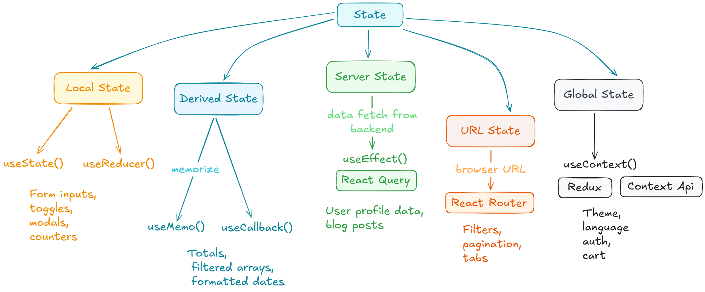


### What is `useState`?

`useState` is a **React Hook** that allows functional components to have state.

> Hooks were introduced to use state without class components.

---

### 🔹 Syntax of `useState`

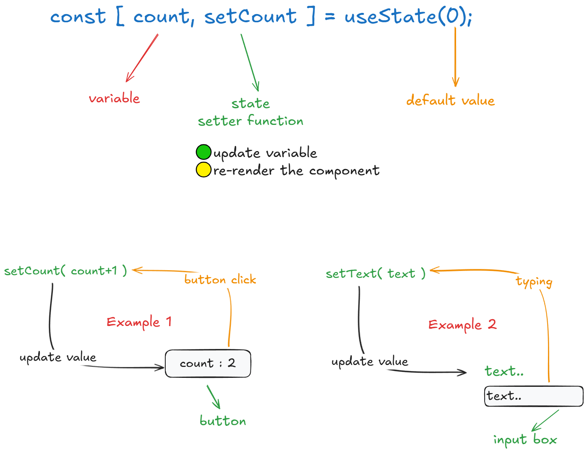


### Example- 1:

- create a `Counter.jsx` component and paste the below code.

```jsx
import { useState } from 'react'

const Counter = () => {
    const [count,setCount]=useState(0);
  return (
    <div style={{padding:"10px",display:"flex",gap:"10px"}}>
        <button onClick={()=>setCount(count+1)}>Increment Count: {count} </button>
        <button onClick={()=>setCount(count-1)}>Decrement Count: {count} </button>
    </div>
  )
}

export default Counter
```

- here , we create a counter component and use `useState` hook to manage the state of the counter.when the user click on the button the state will be changed and the component will be re-rendered.

- call it inside `app.jsx`
```jsx
import Counter from "./components/Counter"

<Counter/>
```

### Example- 2:

- create a `LiveTextPrint.jsx` component and paste the below code.
```jsx
import { useState } from 'react'

const LiveTextPrint = () => {

const [text,setText]=useState('');

  return (
    <div style={{padding:'10px'}}>
        <p>{text}</p>
        <input type="text" onChange={(e)=>setText(e.target.value)} value={text}/>
    </div>
  )
}

export default LiveTextPrint
```
- call it inside `app.jsx`
```jsx
import LiveTextPrint from "./components/LiveTextPrint"

<LiveTextPrint/>
```

## Form Handling

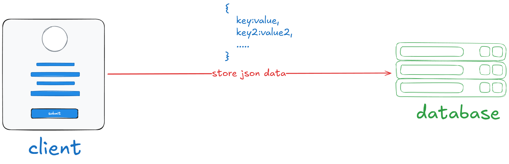

now, with the help of `useState` we can handle the form.
first as it is we create a component named `Form.jsx`, although i create it inside `Form` Folder.

- Folder Structure

forms<br/>
    ├── Form.jsx<br/>
    └── Form.module.css<br/>

inside `Form.jsx ` paste the below code.
```jsx
import { useState } from 'react'
import styles from './Form.module.css'

const Form = () => {

  const [form,setForm]=useState({
    name:"",
    age:18,
    date:new Date().toISOString().split('T')[0],
    gender:"male",
    hobby:[],
    country:"india",
    file:null,
  })

  const handleSubmit=(e)=>{
    e.preventDefault();
    console.log(form);
  }

  const handleHobby=(e)=>{
    const {value,checked}=e.target;
    setForm((prev)=>{
      if(checked){
      // add item
      if(!form.hobby.includes(value)){
         return {...prev,hobby:[...prev.hobby,value]} 
      }
      // if already exists return previous state
      return prev;
    }else{
      // remove item
      return { ...prev, hobby:prev.hobby.filter((item)=>item!==value)}
    }
    })
  }

  return (
    <div style={{ padding: "10px", border: "1px solid gray" }}>
      <form onSubmit={handleSubmit}>
        <label>
            Enter Name: 
            <input 
              type="text"
              name="name" 
              value={form.name} 
              onChange={(e)=>setForm({...form,name:e.target.value})}/>
        </label>
        <br />
        <label>
            Enter Age: 
            <input 
              type="number" 
              min={18}
              max={80}
              value={form.age} 
              onChange={(e)=>setForm({...form,age:e.target.value})}
            />
        </label>
        <br />
        <label>
            Enter D.O.B: 
            <input 
              type="date" 
              name="date"
              value={form.date} 
              onChange={(e)=>setForm({...form,date:e.target.value})}
            />
        </label>
        <br />
        <label>
            Select Gender: 
          <input 
            type="radio" 
            name="gender" 
            value="male" 
            checked={form.gender==="male"}
            onChange={(e)=>setForm({...form,gender:e.target.value})}
            />
          Male
          <input 
            type="radio" 
            name="gender" 
            value="female" 
            checked={form.gender==="female"}
            onChange={(e)=>setForm({...form,gender:e.target.value})}
            />
          Female
        </label>
        <br />
        <label>
            Select Hobbies: 
          <input 
            type="checkbox" 
            name="hobby" 
            value="reading" 
            checked={form.hobby.includes("reading")}
            onChange={handleHobby}
          />
          Reading
          <input 
            type="checkbox" 
            name="hobby" 
            value="traveling"
            checked={form.hobby.includes("traveling")}
            onChange={handleHobby}
           />
          Traveling
          <input 
            type="checkbox" 
            name="hobby" 
            value="sports" 
            checked={form.hobby.includes("sports")}
            onChange={handleHobby}
          />
          Sports
        </label>
        <br />
        <label>
            Select Country: 
          <select name="country" value={form.country} onChange={(e)=>setForm({...form,country:e.target.value})}>
            <option value="india">India</option>
            <option value="usa">USA</option>
            <option value="uk">UK</option>
          </select>
        </label>
        <br />
        <label>
          
          <input type="file" name="file" accept='image/*' onChange={(e)=>setForm({...form,file:e.target.files[0]})}/>
        </label>
        <br />
        <div className={styles.btn}>
            <button type="submit">Submit</button>
        </div>
      </form>
    </div>
  );
}

export default Form
```

> Understand the logic

- 1. first we take a state variable named `form` and initilize it with an `object` with some default value.
```jsx
const [form,setForm]=useState({
    name:"Guest",                                           // 👈 Default value
    age:18,                                                 // 👈 Default value
    date:new Date().toISOString().split('T')[0],           // 👈 Default value
    gender:"male",                                         // 👈 Default value
    hobby:[],                                              // 👈 Default value
    country:"india",                                      // 👈 Default value
    file:null,                                            // 👈 Default value
  })
```

- 2. take all the required feilds.
- 3. now set the `value` of each feild using `useState` object.

📌for `text,number,date,select`
```jsx
value={form.name}
```

📌for `radio`
```jsx
checked={form.gender==="male"}
```

📌for `checkbox`
```jsx
checked={form.hobby.includes("reading")}
```
- 4. now set the `value` of each feild when user change it.

📌for `text,number,date,select`

```jsx
onChange={(e)=>setForm({...form,__feild_name__:e.target.value})}
```

📌for `radio`

```jsx
onChange={(e)=>setForm({...form,gender:e.target.value})}
```

📌for `checkbox`

```jsx
onChange={handleHobby}

const handleHobby=(e)=>{
    const {value,checked}=e.target;
    setForm((prev)=>{
      if(checked){
      // add item
      if(!form.hobby.includes(value)){
         return {...prev,hobby:[...prev.hobby,value]} 
      }
      // if already exists return previous state
      return prev;
    }else{
      // remove item
      return { ...prev, hobby:prev.hobby.filter((item)=>item!==value)}
    }
    })
  }
```

📌for `file`

```jsx
onChange={(e)=>setForm({...form,file:e.target.files[0]})}
```

- 5. now for file set and get the file preview.
```jsx
    <label>
          
          ......
    </label>
```

- 6. Submit the form

we create a function named `handleSubmit` and with the help of `button` we submit the form.

```jsx
const handleSubmit=(e)=>{
    e.preventDefault();
    console.log(form);
  }  
```

- 7. Result

```javascript
{
    "name": "Guest",
    "age": 18,
    "date": "2026-01-28",
    "gender": "male",
    "hobby": [
        "traveling",
        "sports"
    ],
    "country": "india",
    "file": {
      lastModified : 1769238595753,
      lastModifiedDate : Sat Jan 24 2026 12:39:55 GMT+0530 (India Standard Time) {}
      name : "inspect-page.png",
      size : 70852,
      type : "image/png",
      webkitRelativePath: ""
      } // 👈 type: File
}

```
- 8. call the `Form` component inside `App.jsx`

## Todo App

now we create a todo application based on the prevoius knowledge.
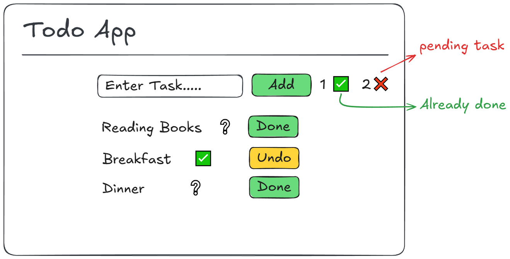

- 1. create a `Todo.jsx` component inside `Projects` folder.
- 2. create a `Todo.module.css` file inside `Projects` folder.
- 3. paste the following code inside `Todo.jsx` file.
```jsx
import { useState } from "react";
import styles from "./Todo.module.css"

const Todo = () => {

    const [todos,setTodos]=useState([]);
    const [singleTodo,setSingleTodo]=useState("");
    const [completed_count,setComepleted_count]=useState(0);

    const handleSubmit=(e)=>{
        e.preventDefault();
        if(singleTodo){
            setTodos([...todos,{todo:singleTodo,done:false}]);
            setSingleTodo("");
            //console.log(todos.length+1);
        }
    }

    const handleDelete=(delete_index)=>{
      const newTodos=todos.map((todo,index)=>index===delete_index?{...todo,done:!todo.done}:todo);
      setTodos(newTodos);
      const completedCount = todos.filter(todo => todo.done).length;
      if(newTodos[delete_index].done){
          setComepleted_count(completedCount+1);
      }else{
        setComepleted_count(completedCount-1);
      }
    }
  return (
    <div className={styles.parent_div}>
        <div className={styles.child_div}>
        <h2>Todo App</h2>
        <hr />
        <form onSubmit={handleSubmit} className={styles.form}>
             <input type="text" value={singleTodo} onChange={(e)=>setSingleTodo(e.target.value)} />
             <button type="submit" className={styles.add_btn}>Add</button>
             <span>✅: {completed_count}</span>
             <span>❌: {todos.length-completed_count}</span>
        </form>
        <ul className={styles.todo_ul}>
            {
                todos.map((todo,index)=>(
                    <li key={index}>
                        {todo.todo} -  {todo.done?<span>✅</span>:<span>❔</span>} - 
                        <button onClick={()=>handleDelete(index)} className={todo.done?styles.undo_btn:styles.done_btn}>
                            {todo.done?<span>undo</span>:<span>done</span>}
                        </button>
                    </li>
                ))
            }
        </ul>
        </div>
    </div>
  )
}

export default Todo
```

> we need three state variables to store the data.

- `todos` : store the todos.
- `singleTodo` : store the single todo.
- `completed_count` : store the completed todos count.

> and take a form to add the todos. then call the `handleSubmit` function on form submit.

> 📌 Logic behind `handleSubmit` function.<br>first, we prevent the default behavior of the form<br> then we check if the `singleTodo` is not empty then we add the todo to the `todos` array, as an object with `todo` and `done` properties.<br> and also reset the `singleTodo`. 

> 📌 Logic behind `handleDelete` function.<br>first, we prevent the default behavior of the form <br> then toggle the `done` value of the todo to be deleted <br> then update the new array.<br> and also update the `completed_count` .


- 4. paste the following code inside `Todo.module.css` file.
```css
.parent_div{
    padding:10px;
    border:1px solid gray;
}
.child_div{
    border:1px solid black;
    padding:10px;
    border-radius:10px;
    width:40%;
    margin:0 auto;
}
.form{
    display:flex;
    justify-content: center;
    gap:10px;
}
.add_btn{
    padding:5px;
    border-radius:5px;
    border:none;
    background-color: green;
    color:white;
}
.undo_btn{
    padding:5px;
    margin: 5px;
    border: none;
    border-radius: 5px;
    background-color: yellow;
    color:black;
}
.done_btn{
    padding:5px;
    margin: 5px;
    border: none;
    border-radius: 5px;
    background-color: greenyellow;
    color:black;
}
```

> for css, we use `styles` variable to access the css file.
like -
```
<div className={styles.parent_div}>
```
in react we use `className` instead of `class`.
- Syntax:
```javascript
import styles from "./__file_name__.module.css"                  //👈 import file

className={styles.__class_name__}                                 //👈 access class
```

## useRef()

> `useRef` is a hook that allows you to `access` DOM elements or `manage` values that persist across re-renders.

> An uncontrolled component stores its value in the DOM, not in React state.so, `useRef` is an uncontrolled component.

| Feature | Controlled | Uncontrolled |
| :--- | :--- | :--- |
| Data stored in | React `state` | `DOM` |
| Data access | through `state` | through `ref` |
| Uses | `useState` | `useRef` |
| Re-render | `Yes` | `No` |
| Validation | Easy | Hard |
| Controll | Full | Limited |
| Common use | Forms, UI | `DOM access` |

- useRef(): Used to store a mutable value that does NOT cause re-render.
Syntax:
```javascript
const __variable__ = useRef(initialValue);
```

> to get the value we use `__variable__.current.value`.

> to set the value we use `__variable__.current.value = value`.

> to focus the input we use `__variable__.current.focus()`.

> in react we use `ref={__variable__}` to access the DOM element.

> 📌📌 We basically create a `reference variable` using useRef() hook.

```jsx
const UseRefState = () => {
    const nameRef = useRef()
    const emailRef = useRef()

    
    const handleSubmit = (e) => {
        e.preventDefault()
        console.log(nameRef.current.value)
        console.log(emailRef.current.value)
        nameRef.current.focus()
    }

  return (
    <div style={{padding:"20px",border:"1px solid black"}}>
        <h2>useRef</h2>
        <form onSubmit={handleSubmit}>
            <label htmlFor="name">Name</label>
            <input type="text" id="name" ref={nameRef} style={{margin:"10px"}}/><br/>

            <label htmlFor="email">Email</label>
            <input type="email" id="email" ref={emailRef} style={{margin:"10px"}}/><br/>

            <button style={{margin:"10px"}}>Submit</button>
        </form>
    </div>
  )
}

export default UseRefState
```

## useEffect()

> `useEffect()` is a special type of hooks that runs `😀automatically` when the component is `rendered`. `rendered` means when the component is `return HTML` from the function.

> `useEffect` is a hook that allows you to perform `side effects` in function components.

> `Side effects` are operations that occur outside of the component's normal flow, such as data fetching, subscriptions, or manually changing the DOM.

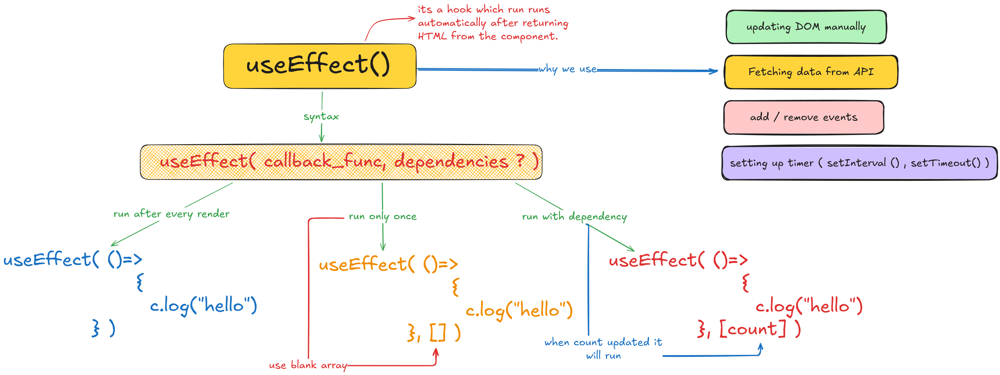

### Runs Every Render

> `useEffect` runs every time when the component is rendered `if` we don't pass any dependency array.

```jsx
import { useEffect, useState } from 'react'

const UseEffect = () => {
    const [count,setCount]=useState(0);

    useEffect(()=>{
        console.log(count);
    })
  return (
    <div>
        <button onClick={()=>setCount(count+1)}>Count:{count}</button>
    </div>
  )
}

export default UseEffect

```

> for every click the component is rendered and erery time useEffect is called.

> Output: 

```
0
1
2
3
... so on
```

### Run Only Once

> `useEffect` runs only once when the component is rendered `if` we pass an empty dependency array.

- just `add an empty array` after callback function in `useEffect()`.

```jsx
 useEffect(
        ()=>{
              console.log(count);
          }
            ,
          []                     // 👈 empty dependency array
    );
```

> Output: 

```
0
```

### Run with dependency

> `useEffect` runs every time when the dependency changes.

- just `add the dependency` after callback function in `useEffect()`.
> which means useEffect function `depends on the count variable`. 

- if count `changes` then useEffect is `called`. 
- but if any variable `without` count is changed then useEffect is `not called`.

```jsx
 useEffect(
        ()=>{
              console.log(count);
          }
            ,
          [count]                 // 👈 dependency array
    );
```

> Output: 

```
0
1
2
3
... so on
```

### Dom manipulation with useEffect()

> we can `change the title of the page` using `useEffect()`.<br> using useEffect we can `manipulate the DOM` like change `the style` , `innerHTML` , `innerText` or `any js code` etc.

```jsx
useEffect(()=>{
        console.log(count);
        document.title=`Count:${count}`; // 👈 dom manipulation
    },[count]);
```

### Timer
create a component `Timer.jsx`

```jsx

import { useEffect, useState } from 'react'

const Timer = () => {
  const [sec,setSec]=useState(0);
  
     useEffect(()=>{
        const interval=setInterval(()=>{
            //setSec(sec+1);
            setSec((prev)=>prev+1);
        },1000);  
        
        return ()=>{
            clearInterval(interval);
        } 
      },[]);
  
    return (
      <div>
          <p>{sec}</p>
      </div>
    )
}

export default Timer
```

---
---

### Windows Width Tracker
its another example of useEffect()

```jsx
import { useEffect, useState } from 'react'

const WindowsWidthTracker = () => {
    const [width,setWidth]=useState(window.innerWidth);
    useEffect(()=>{
        const handleWidth=()=>{
            setWidth(window.innerWidth);
        }
        window.addEventListener('resize',handleWidth);
        return ()=>{    
            window.removeEventListener('resize',handleWidth);
        }

    },[])
  return (
    <div>
        <h1>Windows Width Tracker</h1>  
        <p>Current Width: {width}</p>
    </div>
  )
}

export default WindowsWidthTracker
```
> we need [👉clean up](#cleanup-function) function to remove `double effect` of useEffect.

```jsx
return ()=>{    
            window.removeEventListener('resize',handleWidth);
        }
```

---
---

### Users information show

its another example of `useEffect()`

```jsx
import { useEffect, useState } from 'react'

const Users = () => {
    const [users,setUsers]=useState([]);

    useEffect(()=>{
        fetch('https://jsonplaceholder.typicode.com/users')
        .then(res=>res.json())
        .then(data=>setUsers(data))
    },[])
  return (
    <div>
        {users.map((user)=>(
            <div key={user.id}>
                <h2>{user.name}</h2>
                <p>{user.email}</p>
            </div>
        ))}
    </div>
  )
}

export default Users
```

---
---

#### Important Notes

> 1️⃣ Why setSec(sec + 1) does NOT work in setInterval

```jsx
❌ Your code (problem)
setInterval(() => {
  setSec(sec + 1);
}, 1000);
```

🧠 The REAL reason (very important)

- 👉 setInterval creates a closure
- 👉 React remembers the OLD value of sec
- 👉 sec becomes stuck at initial value (0)

> So every time:

- sec = 0
- setSec(0 + 1)


💥 Result:

- State updates to 1
-Next second → STILL 0 + 1

So it looks like it’s not increasing

2️⃣ Why setSec((prev) => prev + 1) WORKS ✅

```jsx
✅ Correct code
setInterval(() => {
  setSec((prev) => prev + 1);
}, 1000);
```

🧠 Why this works

React gives you the latest state value using prev.

- prev = 0 → 1
- prev = 1 → 2
- prev = 2 → 3


🔥 No stale value
🔥 No closure problem

> ⭐ IMPORTANT RULE (Remember this)

When new state depends on previous state → ALWAYS use callback form

```jsx
setState(prev => prev + 1);
```

> 3️⃣ Why does it increase +2 instead of +1? 😱

This is the part that confuses EVERYONE 👀
And the reason is…

**⚠️ React 18 Strict Mode (DEV ONLY)**

❓ What happens?

In development mode, React runs effects TWICE to find bugs.

📌 Your effect:

```jsx
useEffect(() => {
  const interval = setInterval(() => {
    setSec(prev => prev + 1);
  }, 1000);
}, []);
```

React runs it two times, so:

- Interval #1 → +1
- Interval #2 → +1

👉 Total = +2 every second


> 4️⃣ How to FIX the +2 problem ✅

🛠️ Always clear interval

```jsx
useEffect(() => {
  const interval = setInterval(() => {
    setSec(prev => prev + 1);
  }, 1000);

  return () => clearInterval(interval);
}, []);
```
> 5️⃣ Why cleanup is mandatory 🚨

- Without cleanup:

- Multiple intervals run

- Memory leak

- Faster counter

- Unexpected behavior

---
---

#### What is React Strict Mode?

StrictMode is a development-only helper tool in React.

- 👉 It does NOT affect production
- 👉 It does NOT show anything in UI
- 👉 It only helps developers find bugs early

🔹 How we use it

```jsx
import React from "react";
import ReactDOM from "react-dom/client";
import App from "./App";

ReactDOM.createRoot(document.getElementById("root")).render(
  <React.StrictMode>
    <App />
  </React.StrictMode>
);
```
✅ Main Uses of Strict Mode

> <br>1️⃣ Detects unsafe lifecycle & bad practices 🚨
> <br>.

React checks for:

-Old / unsafe methods
-Code that may break in future React versions

📌 Example:

```jsx
componentWillMount() ❌
```

React warns you:

> “This lifecycle is unsafe”

> <br>2️⃣ Finds side-effect bugs (MOST IMPORTANT 🔥)
> <br>.

StrictMode runs some things twice (only in dev):

- useEffect
- useState initializers
- Component render

❓ Why twice?

To check:

- Are you mutating state?
- Are you forgetting cleanup?
- Are effects safe?

Example:
```jsx
useEffect(() => {
  console.log("Effect running");
}, []);
```


👀 Console output in DEV:

```
Effect running
Effect running
```


👉 React is testing if your code is pure and safe

> <br>3️⃣ Helps detect missing cleanup (interval, event, API)
> <br>.

```jsx
❌ Bad code
useEffect(() => {
  setInterval(() => {
    console.log("tick");
  }, 1000);
}, []);
```


💥 Problem:

- Interval keeps running

- Memory leak

✅ StrictMode exposes this bug

Because it runs effect twice → you see double logs / double speed

👉 You realize:

- “Oh! I forgot cleanup”

✅ Correct code
```jsx
useEffect(() => {
  const id = setInterval(() => {
    console.log("tick");
  }, 1000);

  return () => clearInterval(id);
}, []);
```
> <br>4️⃣ Detects state mutation bugs 🧨
> <br>.

❌ Mutating state
```jsx
state.count++;
setState(state);
```
- StrictMode warns you because:
- React state must be immutable
- Mutation causes unpredictable bugs

> <br>5️⃣ Prepares your app for future React features 🚀
> <br>.

StrictMode checks:

- Concurrent rendering safety
- Future React optimizations
- Async rendering compatibility

📌 Your app becomes future-proof

> <br>6️⃣ Helps beginners learn correct React habits 🎓
> <br>.

React forces you to:

- Write clean useEffect
- Use functional updates
- Avoid side effects in render
- Think immutably

👉 Like a strict teacher in class 😄

---
---

### React LifeCycle


> <br>1️⃣ What is React Lifecycle? (Definition)

👉 React Lifecycle means
the different stages a component goes through from:

```
Creation → Update → Removal
```

Just like human life:

```
Born → Grow → Die 😄
```

2️⃣ React Lifecycle Phases

React component lifecycle has 3 main phases:

| Phase | Meaning |
| :--- | :--- |
| 🟢 Mounting | Component is created |
| 🔵 Updating | Component data changes |
| 🔴 Unmounting | Component is removed |

> <br>🟢 1. **Mounting Phase** (Component is born)<br>. 

When does this happen?

- Component is added to the DOM
- Page loads
- Component is rendered first time

✅ Example (Functional Component)

```jsx
useEffect(() => {
  console.log("Component Mounted");
}, []);
```

- 📌 Empty dependency array []
- 👉 Runs only once

> <br>🔵 2. **Updating Phase** (Component grows)<br>.

When does this happen?

- State changes
- Props change
- Re-render happens

Example
```jsx
useEffect(() => {
  console.log("Component Updated");
```

👉 Runs when count changes

> <br>🔴 3. **Unmounting Phase** (Component dies)<br>.

When does this happen?

- Component removed from UI
- Page change
- Conditional rendering false

use **`👉cleanup function`**

Example
```jsx
useEffect(() => {
  return () => {                                  // 👈 cleanup function
    console.log("Component Unmounted");
  };
}, []);
```

```
Mount
 ↓
Render
 ↓
useEffect (Mount)
 ↓
State / Props change
 ↓
Re-render
 ↓
useEffect (Update)
 ↓
Component removed
 ↓
Cleanup (Unmount)
```
- Example
```jsx
useEffect(() => {
  console.log("Mounted");                                  //👈 1️⃣

  return () => {
    console.log("Unmounted");                             //👈 3️⃣
  };
}, []);


useEffect(() => {
  console.log("Updated");                                 //👈 2️⃣
}, [count]);
```

---
---

### Cleanup Function

> <br>1️⃣ Definition (Simple)<br>.

👉 A cleanup function is a function that React runs

- before a component unmounts OR
- before useEffect runs again

📌 It is used to clean or stop side effects.

> <br>2️⃣ Where does cleanup function exist?<br>.

- 👉 Inside useEffect
- 👉 It is returned from useEffect

```jsx
useEffect(() => {
  // side effect here

  return () => {
    // cleanup code here
  };
}, []);
```
> <br>3️⃣ Why do we need a cleanup function? (Uses)<br>.

✅ To stop:

- setInterval
- setTimeout
- Event listeners
- API subscriptions
- WebSocket connections
- Memory leaks

👉 Basically: Anything that keeps running

> <br>4️⃣ What happens if we don’t use cleanup? ❌<br>.

- App becomes slow
- Multiple intervals run
- Same event fires many times
- Memory leak
- Bugs in StrictMode

> <br>5️⃣ When does cleanup function run? ⏰<br>.

|Situation	|Cleanup Runs?|
|-|:---|
| Component unmounts	|✅ Yes|
| Dependency changes	|✅ Yes|
| StrictMode (dev)	|✅ Yes|
| Production render	|Only when needed|

> <br>6️⃣ Example 1: setInterval ⏱️ (Most common)<br>.

❌ Without cleanup (wrong)
```jsx
useEffect(() => {
  setInterval(() => {
    console.log("Running...");
  }, 1000);
}, []);
```

💥 Problem:

- Interval never stops
- Runs multiple times

✅ With cleanup (correct)

```jsx
useEffect(() => {
  const interval = setInterval(() => {
    console.log("Running...");
  }, 1000);

  return () => {
    clearInterval(interval);
  };
}, []);
```

> <br>7️⃣ Example 2: Event Listener 🎧<br>.

❌ Wrong
```jsx
useEffect(() => {
  window.addEventListener("resize", handleResize);
}, []);
```

💥 Every render adds new listener

✅ Correct
```jsx
useEffect(() => {
  window.addEventListener("resize", handleResize);

  return () => {
    window.removeEventListener("resize", handleResize);
  };
}, []);
```

> <br>8️⃣ Example 3: API Subscription / WebSocket 🌐<br>.

```jsx
useEffect(() => {
  const socket = new WebSocket("ws://example.com");

  return () => {
    socket.close();
  };
}, []);
```

👉 Prevents unnecessary network usage

> <br>9️⃣ Example 4: Timeout ⏲️<br>.
```jsx
useEffect(() => {
  const timeout = setTimeout(() => {
    console.log("Hello");
  }, 3000);

  return () => {
    clearTimeout(timeout);
  };
}, []);
```

> <br>🔟 What cleanup function should NOT do ❌<br>.

- ❌ Update state unnecessarily
- ❌ Make API calls
- ❌ Contain heavy logic
- 👉 Keep it simple & clean

🧠 Easy Analogy 😄

Imagine:

- useEffect = switch ON fan
- Cleanup function = switch OFF fan

Leaving room without switching off = ❌ waste + danger


🧠 Interview-Ready Summary ⭐
🔹 Definition:
- Cleanup function removes side effects created by useEffect.

🔹 Use:
- Prevent memory leaks and unwanted behavior.

🔹 Syntax:
- return () => { /* cleanup */ };


## React Router

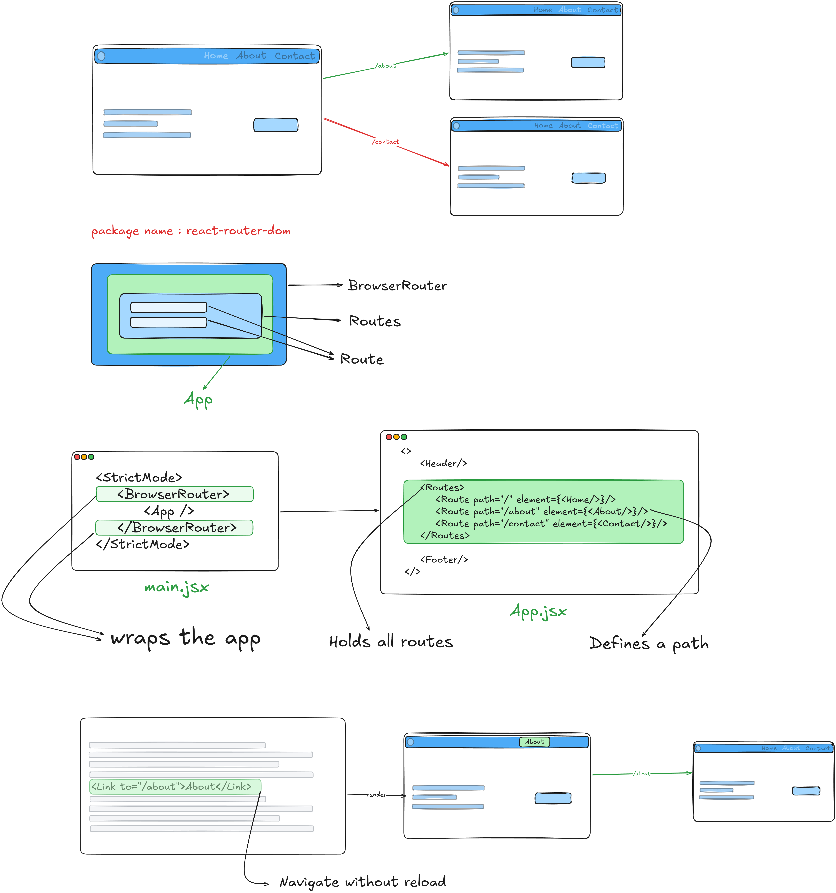

React Router DOM is a library used in React to handle **navigation and routing** in single-page applications (SPA).

---

### 📌 What is Routing?

Routing means:
- Showing different pages
- Changing URL
- Without reloading the whole page

Example:
- `/` → Home page
- `/about` → About page
- `/contact` → Contact page

In React, routing is handled by **react-router-dom**.

---

### 📦 Why do we need react-router-dom?

Without react-router:
- React app shows only **one page**
- URL change reloads the page (bad UX)

With react-router:
- Multiple pages
- Fast navigation
- No page reload
- SPA behavior

---

### ⚙️ Installation

```bash
npm install react-router-dom
```

### 🧠 Core Components of react-router-dom
|Component|Use|
|---|---|
|BrowserRouter|Wraps the app|
|Routes|Holds all routes|
|Route|Defines a path|
|Link|Navigate without reload|
|NavLink|Link with active style|
|useParams|Get URL parameters|
|useNavigate|Navigate programmatically|

### 💻 Programming

- 1. Example Folder Structure

```jsx
src/
 ├─ pages/
 │   ├─ Home.jsx
 │   ├─ About.jsx
 │   └─ Contact.jsx
 ├─ App.jsx
 └─ main.jsx
 ```

 - 2. Basic Routing

 go to `main.jsx` and paste the below code.

```jsx
import React from "react";
import ReactDOM from "react-dom/client";
import { BrowserRouter } from "react-router-dom";
import App from "./App";

ReactDOM.createRoot(document.getElementById("root")).render(
  <StrictMode>
    <BrowserRouter>
        <App />
    </BrowserRouter>
  </StrictMode>,
);
```
>It is the main wrapper for routing.<br>
>👉 Without this, routing will not work.

- 3. Setup path / Route

Go to `App.jsx` and paste the below code.

```jsx
import { Routes, Route } from "react-router-dom";
import Home from "./pages/Home";
import About from "./pages/About";
import Contact from "./pages/Contact";
import Users from "./pages/Users";
import Footer from "./components/Footer";
function App() {
  return (
    <>
      <Header/>

      <Routes>
          <Route path="/" element={<Home/>}/>
          <Route path="/users" element={<Users/>}/>
          <Route path="/about" element={<About/>}/>
          <Route path="/contact" element={<Contact/>}/>
      </Routes>

      <Footer/>
    </>
  );
}

export default App;

```

- 4. Add Link 

go to `Header.jsx` and paste the below code.

```jsx
import { Link } from "react-router-dom"

const Header = () => {
  return (
    <div style={{backgroundColor: "#a9dff5ff", padding: "10px",border: "1px solid #ccc",display: "flex", justifyContent: "space-between"}}>
        <h1>Header</h1>
        <ul style={{display: "flex", gap: "15px", listStyle: "none"}}>
            <li><Link to="/">Home</Link></li>
            <li><Link to="/about">About</Link></li>
            <li><Link to="/contact">Contact</Link></li>
            <li><Link to="/users">Users</Link></li>
        </ul>
    </div>
  )
}

export default Header
```

- 5. for 404 page

we have to create a universal route. and a component.
> 1. define a route inside `app.jsx`
```jsx
      <Routes>
           .......
           <Route path="*" element={<NotFound404/>}/>
      </Routes>
```
> 2. create a component named `NotFound404.jsx` inside `pages` folder.


- 6. Data pass through URL

> define routes in `app.jsx` and pass data through URL
```jsx
      <Routes>
           .......
           <Route path="/user/profile/:id" element={<User/>}/>
      </Routes>
```
> then create a component named `User.jsx` inside `pages` folder although i am creating it inside `app.jsx`.
```jsx
const User=()=>{
    const {id}=useParams();
    //console.log(id);
    return (
        <div>
            <h1>User Profile</h1>
            <p>User ID: {id}</p>
        </div>
    )
}
```

- 7. Nested Routes

> first create a component named `Products.jsx` inside `pages` folder.
```jsx
import { NavLink, Outlet } from 'react-router-dom'

const Products = () => {

  return (
    <div>
        <h2>Products Page</h2>
        <ul>
            <li><NavLink 
            to="mobiles" 
            style={({ isActive }) => ({
                color: isActive ? "red" : "black",
                fontWeight: isActive ? "bold" : "normal"
            })}
            >Mobiles</NavLink></li>
            <li><NavLink 
            to="laptops"
            style={({ isActive }) => ({
                color: isActive ? "red" : "black",
                fontWeight: isActive ? "bold" : "normal"
            })}
            >Laptops</NavLink></li>
        </ul>

        <Outlet/>

    </div>
  )
}

export default Products
```
- here we create the nested link for different products.
- `Outlet` is a Component which is used to render the nested components.
- here i use `NavLink` instead of `Link` to add style to the active link.


> then create a component named `Mobiles.jsx` and `Laptop.jsx` inside `pages` folder.
```jsx
import React from 'react'

const Mobiles = () => {
  return (
    <div>
        <h2>Here are the Top Mobiles</h2>
        <ul>
            <li>Apple iphone 17</li>
            <li>Samsung Galaxy S23</li>
            <li>OnePlus Nord 2</li>
        </ul>
    </div>
  )
}

export default Mobiles
```

and
```jsx
import React from 'react'

const Laptop = () => {
  return (
    <div>
        <h2>Here are the Top Laptops</h2>
        <ul>
            <li>Apple Macbook Pro</li>
            <li>Samsung Galaxy Tab</li>
            <li>Lenevo Thinkpad</li>
        </ul>
    </div>
  )
}

export default Laptop
```

> define routes inside `app.jsx`
```jsx
      <Routes>
           .......
           <Route path="/products" element={<Products/>}>
               <Route path="mobiles" element={<Mobiles/>}/>
               <Route path="laptops" element={<Laptop/>}/>
               ......
          </Route>
          .......
      </Routes>
```